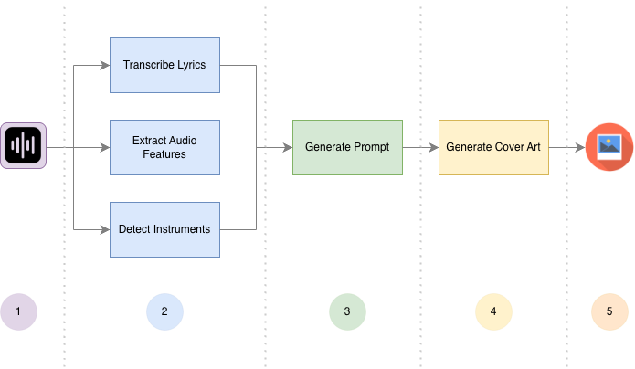
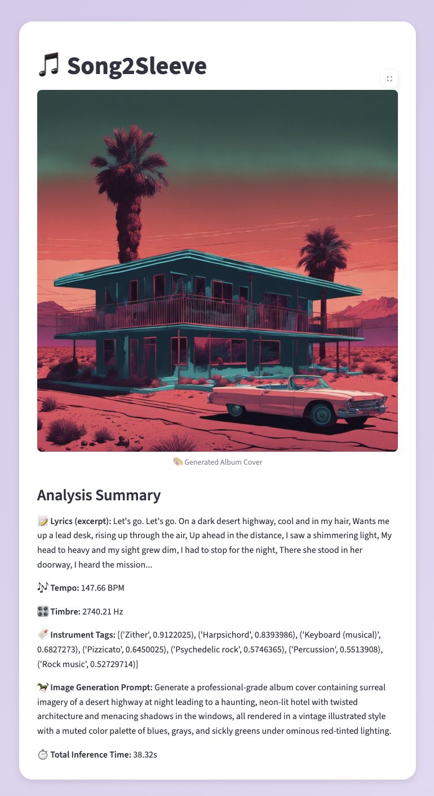

# 🎵 Song2Sleeve

## 📘 Introduction

**Song2Sleeve** is a Streamlit-based system for automatic **cover art generation** from an audio file. The core contribution of this work is a multi-modal conditioning pipeline that integrates **(1) lyric-level semantic features**, extracted via speech-to-text, and **(2) audio-driven descriptors** such as timbre, tempo, instrument tags, and instrument tags. This combined representation is used to condition a generative image model, enabling the creation of coherent, music-aware album artwork.

Album covers serve as a high-level visual summary of a track’s mood, style, and artistic identity. By unifying audio analysis with modern text-to-image models, Song2Sleeve demonstrates how cross-modal signals can enhance creative generation and yield more contextually aware artwork than lyric-only approaches.

## 🕵🏻‍♀️ How it works



1. **Upload** a `.wav` audio file.
2. **Analyze** the song:
   - Transcribe lyrics with [Faster‑Whisper](https://github.com/guillaumekln/faster-whisper),
   - Extract tempo & spectral centroid (timbre) with [librosa](https://librosa.org),
   - Tag instruments with [YAMNet](https://tfhub.dev/google/yamnet/1).
3. **Generate a prompt** with [Claude 3 Sonnet](https://aws.amazon.com/bedrock/) using the outputs from stage 2.
4. **Create a cover** with [Stable Diffusion XL](https://aws.amazon.com/bedrock/), using the prompt generated from the previous stage.
5. **Output** A unique cover art image generated from extracted lyrics & audio elements.

## 🥞 Tech Stack

- **Frontend:**: [**Streamlit**](https://streamlit.io) (UI, uploads, visualization).

- **Backend**: Python modular pipeline; on-instance inference with Demucs, Faster-Whisper, librosa, YAMNet (PyTorch/TF)

- **Cloud Inference**: on-instance inference with Demucs, Faster-Whisper, librosa, YAMNet (PyTorch/TF)

- **Deployment**: AWS EC2 (t3.medium) + optional GPU Spot; Docker + Poetry for reproducible environments

## 📦 Local Installation

> ⚠️ AWS Bedrock access is required for Claude & Stable Diffusion.  
> Set your AWS credentials (`AWS_ACCESS_KEY_ID`, `AWS_SECRET_ACCESS_KEY`) in your environment.

### 1️⃣ Clone the repository

```bash
git clone https://github.com/megan1811/song2sleeve.git
cd song2sleeve
```

### 2️⃣ Install dependencies

Using Poetry:

```bash
poetry install
poetry shell
```

Or using pip:

```bash
pip install -r requirements.txt
```

### 3️⃣ Run the app

```bash
streamlit run app.py
```

Open your browser at http://localhost:8501.

### 4️⃣ Interface Example

✨ \*Below is a snapshot of the app interface, after generating album art for the famous song **“Hotel California.”\*** by the Eagles. ✨



## 📂 Project Structure

```bash
song2sleeve/
│
├── app.py            # Streamlit frontend
├── pipeline.py       # High-level audio-to-image pipeline
├── client.py         # AWS Bedrock client (Claude & SDXL)
├── models.py         # Transcription (Whisper) & tagging (YAMNet)
├── utils.py          # Feature extraction & prompt structuring
├── poetry.toml       # Poetry dependency configuration
└── README.md         # Project documentation
```

## 🐾 Next Steps

A promising evolution of this project would be to develop an **audio–image embedding model**, similar to [**CLIP**](https://github.com/openai/CLIP), that aligns audio representations directly with an image latent space. Unlike CLIP’s text–image contrastive setup, this approach would learn a joint space between audio features and visual concepts, allowing the model to capture musical and lyrical information end-to-end.

By bypassing the intermediate text-prompt stage, the system would preserve information often lost during transcription & instrument tagging as emotional tone and stylistic nuance. My hypothesis is that conditioning image generation on learned audio embeddings (rather than text prompts) would produce cover art that more faithfully reflects the input track’s artistic identity.
